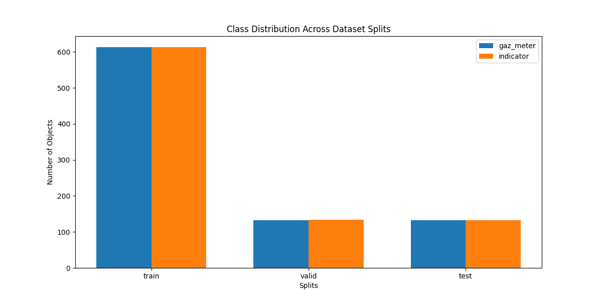
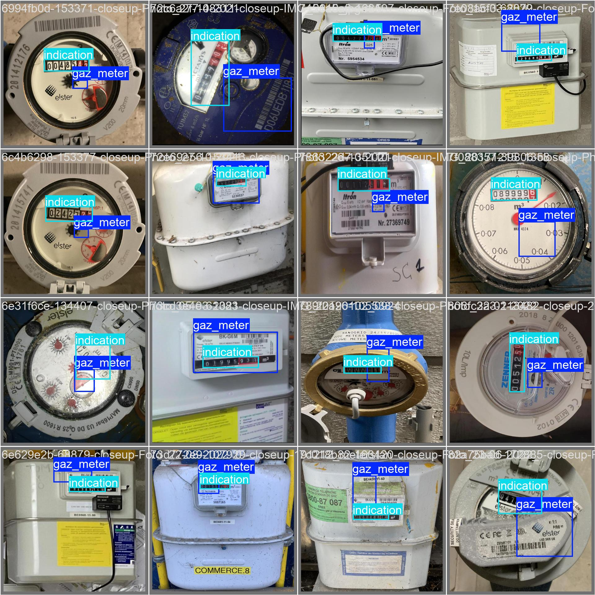
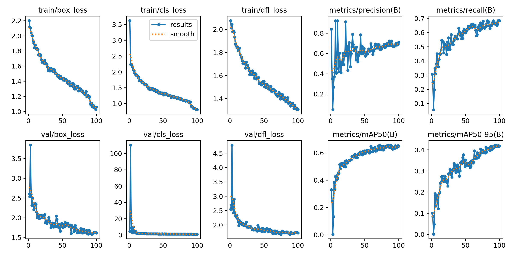
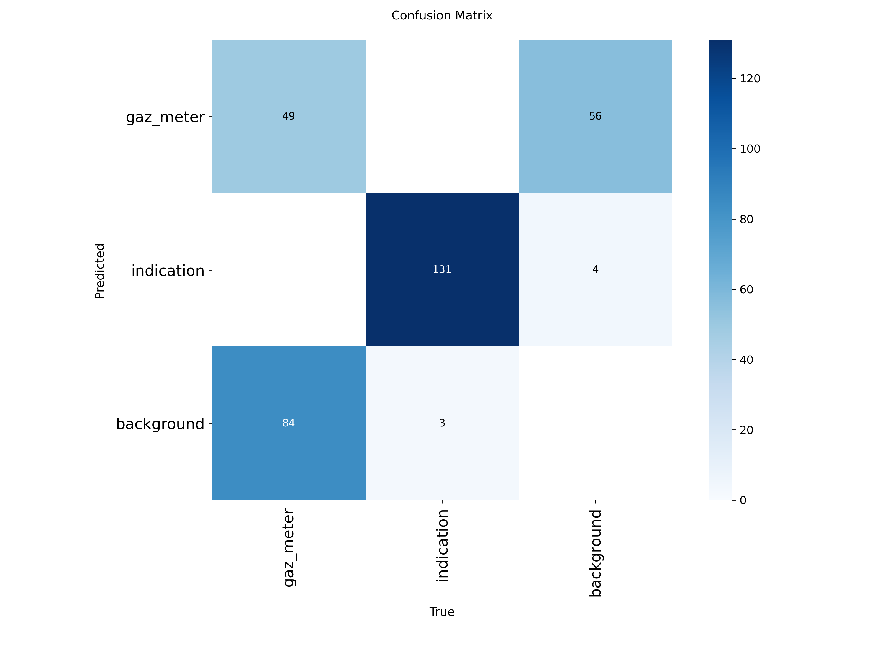
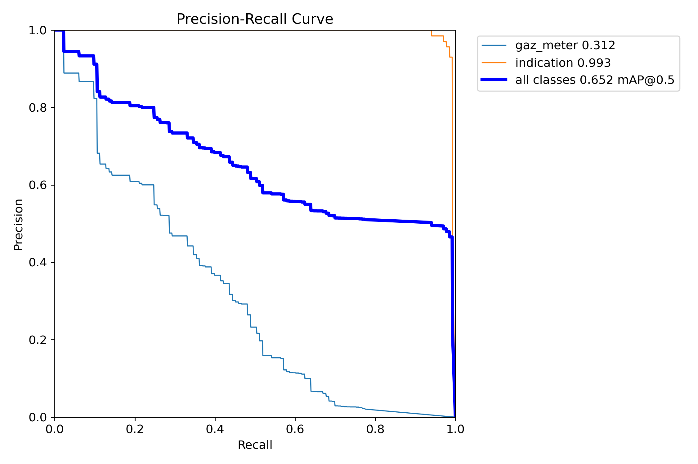
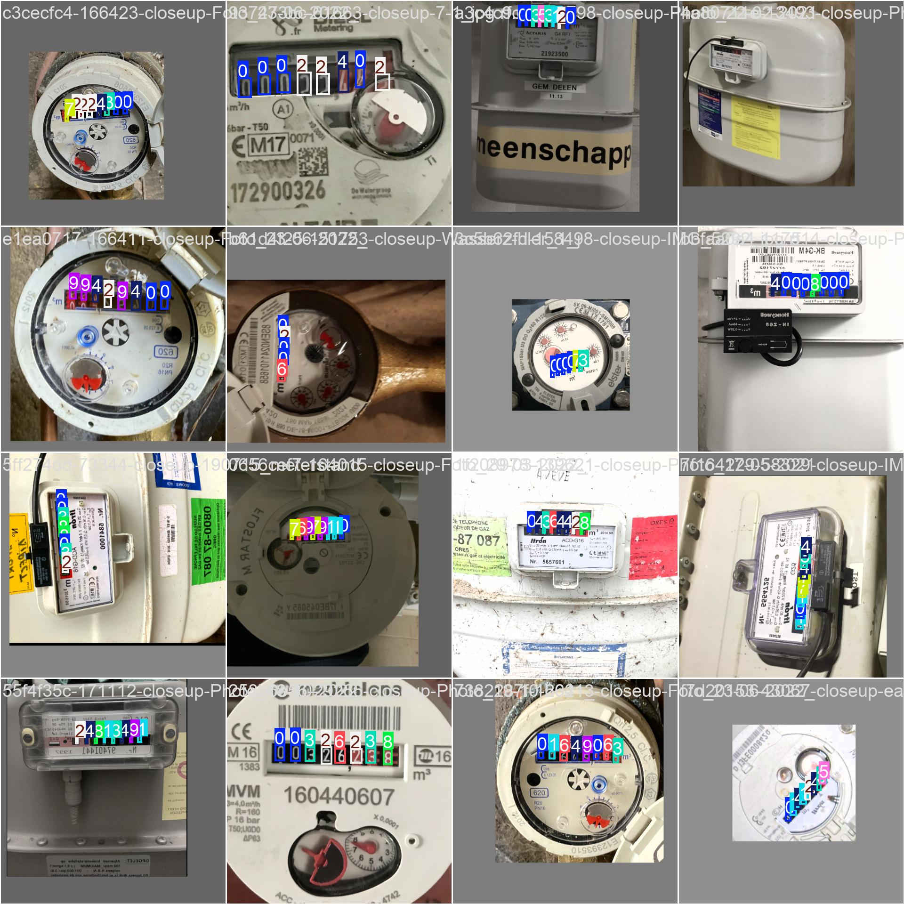
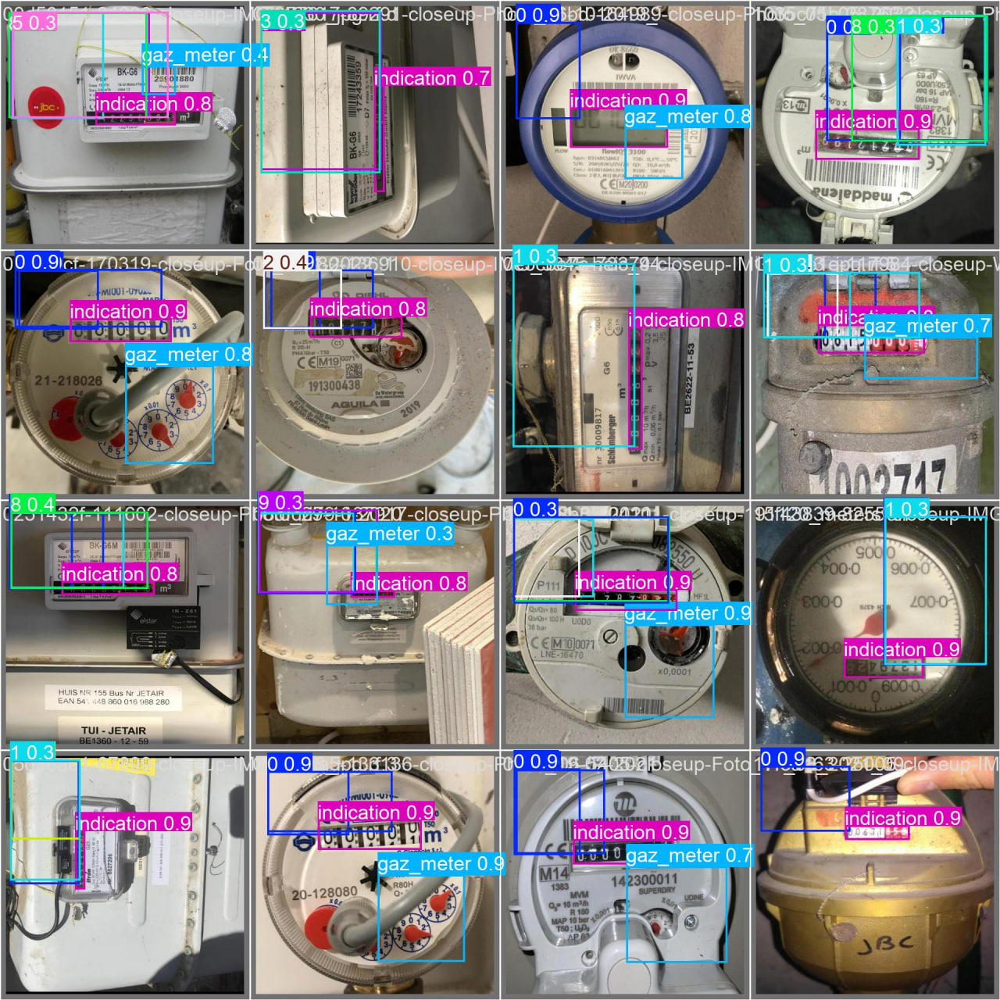

# Отчет по проекту распознавания показаний газовых счетчиков

## 1. Проработка датасета

### 1.1 Структура датасета

Датасет разделен на три части:
- Тренировочная выборка: 613 изображений
- Валидационная выборка: 133 изображения
- Тестовая выборка: 132 изображения

### 1.2 Классы и разметка

В итоговом датасете представлено 2 класса:
- Класс `gaz_meter` для определения области счетчика
- Класс `indicator` для определения области цифр

### 1.3 Разметка датасета
Разметка датасета проводилась в 3 вариантах с использованием платформы Roboflow:
https://app.roboflow.com/gas-meter-ppd1w/gas-meter-66xvw/3

### 1.4 Предобработка и анализ датасета

Анализ и предобработка датасета `src/process_dataset.py` были выполнены:
- Анализ распределения классов
- Проверку размеров и разрешений изображений
- Подсчет статистики аннотаций
- Визуализацию распределения данных

Результаты анализа можно изучить в:
- `dataset_gaz/dataset_analysis.md` - подробный отчет о структуре датасета
- `dataset_gaz/class_distribution.png` - визуализация распределения классов

Основные характеристики датасета:
- Среднее разрешение изображений: 640x640 пикселей
- Сбалансированное распределение классов (см. график)
- Качественная разметка в формате YOLO

## 2. Архитектура нейронной сети

### 2.1 Выбор архитектуры

Для решения задачи была выбрана архитектура YOLO11s:
- 181 слой
- 9,432,049 параметров
- 21.6 GFLOPs

Основные компоненты архитектуры:
- Backbone: модифицированная CSPDarknet
- Neck: PANet
- Head: Decoupled head для классификации и регрессии

### 2.2 Обоснование выбора

1. Эффективность:
   - Легкая архитектура (11s) подходит для задачи с ограниченным количеством классов
   - Баланс между скоростью и точностью

2. Особенности архитектуры:
   - Decoupled head улучшает точность детекции мелких объектов (цифр)
   - PANet улучшает обработку признаков на разных масштабах

## 3. Пайплайн обучения

### 3.1 Конфигурация обучения

#### Основные параметры:
- Оптимизатор: AdamW (выбран на основе автоматического подбора)
- Learning rate: 0.001667
- Momentum: 0.9
- Weight decay: 0.0005
- Размер батча: 16
- Количество эпох: 100
- Количество workers: 8
- Кэширование: на диск (для детерминированных результатов)

#### Параметры аугментации:
- HSV преобразования:
  - Оттенок (hsv_h): 0.015
  - Насыщенность (hsv_s): 0.7
  - Яркость (hsv_v): 0.4
- Геометрические преобразования:
  - Поворот (degrees): 10.0°
  - Сдвиг (translate): 0.1
  - Масштабирование (scale): 0.5
  - Горизонтальное отражение (fliplr): 0.5
- Комплексные аугментации:
  - Mosaic: вероятность 1.0
  - Mixup: вероятность 0.1
  - Отключение мозаики: за 10 эпох до конца

#### Параметры обучения:
- Warmup: 3 эпохи
- Ранняя остановка: patience = 50
- Сохранение чекпойнтов: каждые 10 эпох
- Детерминированное обучение: кэширование на диск

### 3.2 Метрики качества

#### Финальные результаты (эпоха 100):

Общие метрики:
- mAP50: 0.66736
- mAP50-95: 0.47635

По классам (Precision/Recall/mAP50):
1. Цифры (0-9):
   - Средняя точность (P): 0.84-0.96
   - Средний recall (R): 0.69-0.93
   - Средний mAP50: 0.78-0.95

2. Класс gaz_meter:
   - Precision: 0.524
   - Recall: 0.364
   - mAP50: 0.369

### 3.3 Анализ обучения

1. Динамика loss:
   - box_loss: снижение с 1.92 до 0.79
   - cls_loss: снижение с 4.18 до 0.59
   - dfl_loss: снижение с 1.83 до 1.14

2. Прогресс по эпохам:
   - Быстрое улучшение в первые 20 эпох
   - Стабилизация метрик после 60 эпохи
   - Небольшое улучшение в последние эпохи

### 3.4 Анализ ошибок

1. Ошибки первого рода (False Positives):
   - Основная проблема с классом gaz_meter
   - Низкая precision (0.524) указывает на ложные срабатывания

2. Ошибки второго рода (False Negatives):
   - Значительные пропуски для класса gaz_meter (recall 0.364)
   - Хорошее обнаружение цифр (recall > 0.7)

## 4. Выводы

Модель показывает хорошие результаты в распознавании цифр (mAP50 > 0.78), но требует улучшения в детекции самого счетчика. Основные проблемы связаны с классом gaz_meter, где наблюдаются как ложные срабатывания, так и пропуски объектов.

 

### При подготовке дополнительно были исследованы варианты с распознаванием только цифр (10 классов), который также показал хороший результат:

### А также вариант с разметкой на 12 классов, что дало низкий результат

